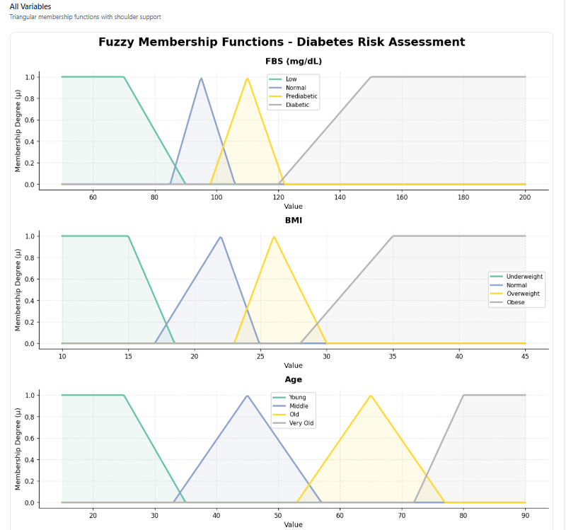

### Fuzzy Diabetes Risk Assessment API

A **FastAPI-based** backend that uses a fuzzy expert system to assess diabetes risk based on key physiological and lifestyle factors.

## 🚀 Features

* Built with **FastAPI** and **Pydantic**
- Fuzzy logic inference using a custom Python library ([`fuzzy_expert_lib`](https://github.com/BinongoIsrael/fuzzy_expert_lib.git))

* Supports input features:

  * Fasting Blood Sugar (FBS)
  * Body Mass Index (BMI)
  * Age
  * Physical Activity
* Returns a **risk classification** (Low, Moderate, or High)

## 🧩 Folder Structure

```
backend/
├── main.py
├──docs
├──└──plot_all_example.png
├── fuzzy_expert_lib/
│   └── fuzzy_expert/
│       └── system.py
├── requirements.txt
├── .gitignore
└── README.md
```

## 🧠 Example Request / Response

**POST** → `/assess`

### Request

```json
{
  "fbs": 110,
  "bmi": 27.5,
  "age": 45,
  "physical_activity": 45
}
```

### Response

```json
{
  "crispValue": 50.00,
  "classification": "Moderate"
}
```

---

## 📊 Membership Function Graphs

This API also includes endpoints to **visualize fuzzy membership functions** used in the risk assessment model.

### 🖼️ Example Endpoints

| Variable              | Endpoint         | Description                                        |
| --------------------- | ---------------- | -------------------------------------------------- |
| **All Variables**     | `/plot/all`      | Displays all membership functions in one figure    |
| **FBS**               | `/plot/fbs`      | Fasting Blood Sugar membership sets                |
| **BMI**               | `/plot/bmi`      | Body Mass Index membership sets                    |
| **Age**               | `/plot/age`      | Age-based fuzzy categories                         |
| **Physical Activity** | `/plot/physical` | Weekly physical activity intensity                 |
| **Risk (Output)**     | `/plot/risk`     | Fuzzy risk output categories (Low, Moderate, High) |

### 🧠 Example Usage

Once your backend is running (e.g., `uvicorn main:app --reload`), open any of these in your browser:

```
http://localhost:8000/plot/all
http://localhost:8000/plot/fbs
http://localhost:8000/plot/bmi
http://localhost:8000/plot/age
http://localhost:8000/plot/physical
http://localhost:8000/plot/risk
```

Each endpoint will render a **PNG image** generated dynamically using `matplotlib`, showing how fuzzy membership degrees change across value ranges.

### 📈 Example Graph Preview

Below is an example of what `/plot/all` looks like when rendered:




---

## ⚙️ Running Locally

### 1️⃣ Install dependencies

```bash
pip install -r requirements.txt
```

### 2️⃣ Run the server

```bash
uvicorn main:app --host 0.0.0.0 --port 8000
```

---

## 🌐 Deploying to Render

### Prerequisites

* A **GitHub** account
* Your project pushed to a GitHub repository

### Steps

1. Go to [https://render.com](https://render.com)
2. Click **New + → Web Service**
3. Connect your GitHub repo
4. Configure these settings:

| Field             | Value                                          |
| ----------------- | ---------------------------------------------- |
| **Build Command** | `pip install -r requirements.txt`              |
| **Start Command** | `uvicorn main:app --host 0.0.0.0 --port 10000` |
| **Environment**   | Free                                           |
| **Region**        | Singapore (or nearest to you)                  |

5. Click **Deploy Web Service** 🚀
6. Once deployed, open your API:

   ```
   https://fuzzy-diabetes-api.onrender.com/
   ```

---

## 🔄 Updating

When you push updates to your GitHub repo:

* Render automatically redeploys your app.

Manual trigger:

```bash
git add .
git commit -m "Update fuzzy rules"
git push
```

---

## 🧠 CORS Configuration

The app uses FastAPI's CORS middleware:

```python
app.add_middleware(
    CORSMiddleware,
    allow_origins=["http://localhost:5173", "*"],  # for local + demo use
    allow_credentials=True,
    allow_methods=["*"],
    allow_headers=["*"],
)
```

For production, you can restrict it to your frontend domain:

```python
allow_origins=[
  "http://localhost:5173",
  "https://your-frontend.vercel.app"
]
```

---

## 🧩 Example Frontend Fetch (Vite/React)

```js
fetch("https://fuzzy-diabetes-api.onrender.com/assess", {
  method: "POST",
  headers: { "Content-Type": "application/json" },
  body: JSON.stringify({
    fbs: 100,
    bmi: 24,
    age: 30,
    physical_activity: 40
  })
})
  .then(res => res.json())
  .then(data => console.log(data));
```

---

## 🛠 Requirements

* Python 3.9+
* FastAPI
* Uvicorn
* Pydantic

---

## 🧑‍💻 Author

**Israel Binongo**
*Fuzzy Logic Expert System Developer*
📧 [israelmelorenbinongo@gmail.com](mailto:israelmelorenbinongo@gmail.com)
🔗 [GitHub Profile](https://github.com/BinongoIsrael)

---

> 💡 *"Smarter health insights through fuzzy logic."*
